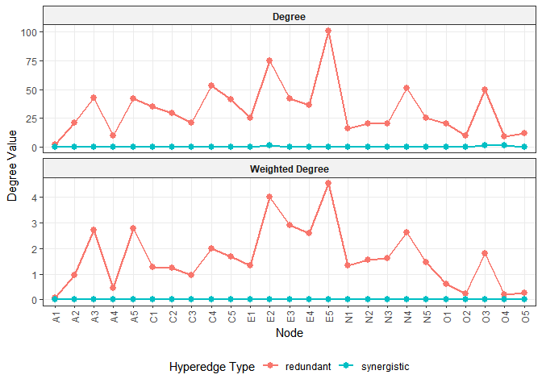
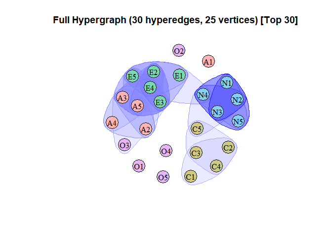
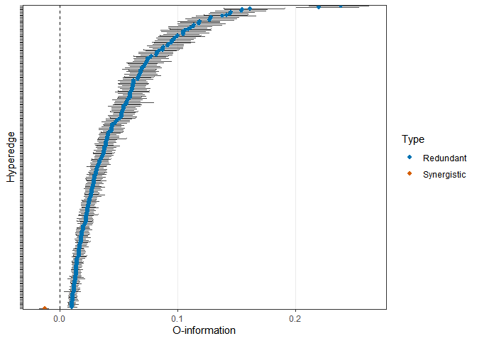

<!-- README.md is generated from README.Rmd. Please edit that file -->

# psychHypergraph

<!-- badges: start -->

<!-- badges: end -->

**psychHypergraph** implements information-theoretic hypergraph analysis
for psychometric data, based on Marinazzo et al. (2024) and Possenti et
al. (2026). The package provides tools for constructing psychometric
hypergraphs, identifying synergistic and redundant higher-order
interactions, centrality analysis, clustering, and visualization.

## Installation

``` r
# install.packages("remotes")
remotes::install_github("rheniumyuan/psychHypergraph")
```

## Key Features

- **Hypergraph construction** via `build_hypergraph()`: a complete
  pipeline that preprocesses data, generates candidate hyperedges,
  computes O-information, and performs three-step hyperedge validation
  and selection (permutation test, bootstrap stability assessment, and
  hierarchical validation) (Possenti et al., 2026).
- **O-information**: an information-theoretic measure proposed that
  quantifies the balance between redundant and synergistic higher-order
  statistical dependencies among variables (Rosas et al., 2019).
- **Multiple candidate generation strategies**: implements exhaustive
  search and clique-based candidate generation strategies.
- **Node degree centrality** via `node_degree()`: calculate node degree
  centrality for each node.
- **Spectral clustering** via `spectral_clustering()`: perform spectral
  clustering (similar to `HySC` in python library `hypergraphx (HGX)`)
  on hypergraphs.
- **Visualization**: `plot()` for hypergraph visualization (based on
  `HyperG` package), `plot_hyperedge()` for forest plots of
  O-information estimates, and `plot_node_degree()` for centrality
  profiles.

## Example

### Constructing a psychometric hypergraph

``` r
library(psychHypergraph)

# Load example data
data(bfi, package = "psych")

# Build a psychometric hypergraph using clique-based candidate generation
hg <- build_hypergraph(
  data = bfi[, 1:25],
  cor_method = "pearson",
  k = 3:4,
  candidate_method = "clique",
  n_perm = 100, # Reduced for faster example; use 1000+ for real analysis
  n_boot = 100,
  seed = 123,
  parallel = FALSE
)
#> Step 0/3: Preprocessing data...
#> Generating candidate multiplets using method: clique
#> Total candidate multiplets: 554
#> Step 1/3: Running permutation tests (n = 100)...
#> Step 2/3: Running BCa bootstrap validation (n = 100)...
#> Step 3/3: Running hierarchical validation...
#> Completed: Found 236 significant hyperedges.
#> Building hypergraphs...

# Inspect results
print(hg)
#> psychHypergraph Object Summary
#> ==============================
#> 
#> Subjects: 2800
#> Variables: 25
#> Candidate Multiplets Evaluated: 554
#> Total Significant Hyperedges: 236
#>   - Redundant (O-info > 0): 235
#>   - Synergistic (O-info < 0): 1
#> 
#> O-Info Statistics:
#>   Range: [-0.013, 0.239]
#>   Mean (abs): 0.048
#> 
#> Parameters:
#>   cor_method: pearson
#>   k: 3, 4
#>   Candidate selection method: clique
#> 
#> Use $hypergraph to access full hyperedge list
#> Use $hyperedge_details to view complete test results
#> 
#> To plot:
#>   plot(x)                    # Full hypergraph
#>   plot(x, type='redundant')  # Only redundant
#>   plot(x, type='synergistic')# Only synergistic
#>   plot(x, top_n=10)          # Top 10 by |O-info|
```

### Analyzing the structure of the hypergraph

``` r
# Node degree centrality
plot_node_degree(hg, graph_type = c("synergistic","redundant"), style = "both")
```



``` r

# Spectral clustering
clustering <- spectral_clustering(hg, K = 5)
print(clustering)
#> Hypergraph Spectral Clustering Results
#> =====================================
#> Number of nodes: 25
#> Number of hyperedges: 236
#> Number of clusters (K): 5
#> Clustering method: Binary Laplacian
#> Non-isolated nodes: 25
#> Isolated nodes: 0
#> 
#> Cluster sizes:
#>   cluster size proportion
#> 1       1    5        0.2
#> 2       2    5        0.2
#> 3       3    5        0.2
#> 4       4    5        0.2
#> 5       5    5        0.2
#> 
#> First few eigenvalues:
#> [1] 0.0000 0.2390 0.3102 0.4111 0.5549
```

### Visualizing the hypergraph

``` r
# Visualize the hypergraph
plot(hg, top_n = 30, type = "full", vertex.size = 20, groups = clustering$membership)
#> Selected top 30 hyperedges by absolute O-info
```



``` r

# visualize hyperedges
plot_hyperedge(hg, show_edge_label = FALSE, significant_only = TRUE)
```



## References

- Marinazzo, D., Van Roozendaal, J., Rosas, F. E., Stella, M.,
  Comolatti, R., Colenbier, N., Stramaglia, S., & Rosseel, Y. (2024). An
  information-theoretic approach to build hypergraphs in psychometrics.
  *Behavior Research Methods*, *56*(7), 8057–8079.
  <https://doi.org/10.3758/s13428-024-02471-8>
- Possenti, F., Girelli, L., Tieri, P., & Petti, M. (2026). Multiplex
  Hypergraph Modeling of Higher Order Structures in Psychometric
  Networks (Version 1). arXiv.
  <https://doi.org/10.48550/ARXIV.2604.22744>
- Rosas, F. E., Mediano, P. A. M., Gastpar, M., & Jensen, H. J. (2019).
  Quantifying high-order interdependencies via multivariate extensions
  of the mutual information. *Physical Review E*, *100*(3), 032305.
  <https://doi.org/10.1103/PhysRevE.100.032305>
